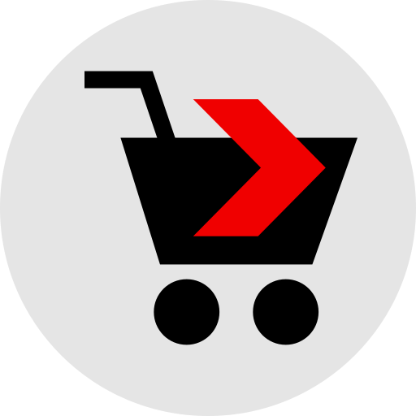

<!-- Improved compatibility of back to top link: See: https://github.com/othneildrew/Best-README-Template/pull/73 -->

<a name="readme-top"></a>

<!-- PROJECT LOGO -->
<br />
<div align="center">
  <a href="https://github.com/omidhzr/ecom">
    

  <h3 align="center">ECOM</h3>

  <p align="center">
    <br />
    <br />
    <a href="https://ecom-52274.web.app">View Demo</a>
    ·
    <a href="https://github.com/omidhzr/ecom/issues">Report Bug</a>
    ·
    <a href="https://github.com/omidhzr/ecom/issues">Request Feature</a>
  </p>
</div>

<!-- TABLE OF CONTENTS -->
<details>
  <summary>Table of Contents</summary>
  <ol>
    <li>
      <a href="#about-the-project">About The Project</a>
      <ul>
        <li><a href="#built-with">Built With</a></li>
      </ul>
    </li>
    <li>
      <a href="#getting-started">Getting Started</a>
      <ul>
        <li><a href="#prerequisites">Prerequisites</a></li>
        <li><a href="#installation">Installation</a></li>
      </ul>
    </li>
    <li><a href="#usage">Usage</a></li>
    <li><a href="#roadmap">Roadmap</a></li>
    <li><a href="#license">License</a></li>
    <li><a href="#contact">Contact</a></li>
    <li><a href="#acknowledgments">Acknowledgments</a></li>
  </ol>
</details>

<!-- ABOUT THE PROJECT -->

## About The Project

[![ECOM Screen Shot][product-screenshot]](https://ecom-52274.web.app)

<p align="right">(<a href="#readme-top">back to top</a>)</p>

### Built With

List of frameworks/libraries used.

- [![React][react.js]][react-url]
- [![TypeScript][typescriptlang]][typescript-url]
- [![Bootstrap][bootstrap.com]][bootstrap-url]
- [![Firebase][firebase.come]][firebase-url]

<p align="right">(<a href="#readme-top">back to top</a>)</p>

<!-- GETTING STARTED -->

## Getting Started

### Prerequisites

- npm
  ```sh
  npm install npm@latest -g
  ```
  Or
  <br/>
- yarn
  ```sh
  npm install --global yarn
  ```

### Installation

<br/>
If you want to install and run the web app on your local machine you need to follow the instructions below

1. Clone the repo
   ```sh
   git clone https://github.com/omidhzr/ecom
   ```
2. Go to the project directory
   ```sh
   cd [to the directory that you have cloned the project in]
   cd ecom
   ```
3. Install NPM packages
   ```sh
   npm install
   ```
4. Run
   ```sh
   npm start
   ```
5. Visit
   ```sh
   localhost:3000/
   ```

<p align="right">(<a href="#readme-top">back to top</a>)</p>

<!-- USAGE EXAMPLES -->

## Usage

You can use the ECOM webshop like any other webshop.

In order to be able to put products to your shopping cart you need to sign up first.

You can remove or buy several of the same items in your shopping cart as well and pay via the most common payment methods such as Paypal, Stripe and Swish (WIP)

<p align="right">(<a href="#readme-top">back to top</a>)</p>

<!-- ROADMAP -->

## Roadmap

- [x] Add Home Page
- [x] Add Authentication
- [x] Add and retrieve Products to/from Firebase
- [x] Add Admin page to support adding and retrieval
- [x] Convert to Typescript
- [x] Add Dark Mode theme
- [ ] Add Shopping Cart
  - [x] a simple shopping cart to add and delete products from the home page
  - [ ] Add Checkout and Payment using Paypal / Stripe / Swish
- [ ] Use redux for state management
- [ ] Make a Proxy API using node express to call firebase admin sdk
  - [ ] protect the admin page using role based auth
- [ ] Employ Lazy Loading
- [ ] Write tests for components
- [ ] Use Docker to host the Server
- [ ] Restructure and Refactor the codebase
- [ ] Add third-party SignIn process (via google) so that the user do not need to register with us

<p align="right">(<a href="#readme-top">back to top</a>)</p>

<!-- LICENSE -->

## License

Distributed under the MIT License.

<p align="right">(<a href="#readme-top">back to top</a>)</p>

<!-- CONTACT -->

## Contact

[![LinkedIn][linkedin-shield]][linkedin-url]

Email: omidhazara@gmail.com

Project Link: [https://github.com/omidhzr/ecom](https://github.com/omidhzr/ecom)

<p align="right">(<a href="#readme-top">back to top</a>)</p>

<!-- ACKNOWLEDGMENTS -->

## Acknowledgments

- [GitHub Emoji Cheat Sheet](https://www.webpagefx.com/tools/emoji-cheat-sheet)
- [Malven's Flexbox Cheatsheet](https://flexbox.malven.co/)
- [Malven's Grid Cheatsheet](https://grid.malven.co/)
- [Img Shields](https://shields.io)
- [GitHub Pages](https://pages.github.com)
- [Font Awesome](https://fontawesome.com)
- [Google fonts](https://fonts.google.com)
- [React Icons Kit](https://react-icons-kit.vercel.app/)
- [React Icons](https://react-icons.github.io/react-icons/search)

<p align="right">(<a href="#readme-top">back to top</a>)</p>

<!-- MARKDOWN LINKS & IMAGES -->

[linkedin-shield]: https://img.shields.io/badge/-LinkedIn-black.svg?style=for-the-badge&logo=linkedin&colorB=555
[linkedin-url]: https://linkedin.com/in/omidhazara
[product-screenshot]: ./src/images/Ecom-Screenshot.png
[react.js]: https://img.shields.io/badge/React-20232A?style=for-the-badge&logo=react&logoColor=61DAFB
[react-url]: https://reactjs.org/
[bootstrap.com]: https://img.shields.io/badge/Bootstrap-563D7C?style=for-the-badge&logo=bootstrap&logoColor=white
[bootstrap-url]: https://getbootstrap.com
[typescriptlang]: https://img.shields.io/badge/typescript-%23007ACC.svg?style=for-the-badge&logo=typescript&logoColor=white
[typescript-url]: https://www.typescriptlang.org
[bootstrap-url]: bootstrap.com
[firebase-url]: firebase.come
[firebase.come]: https://img.shields.io/badge/firebase-%23039BE5.svg?style=for-the-badge&logo=firebase
